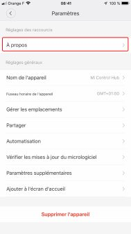
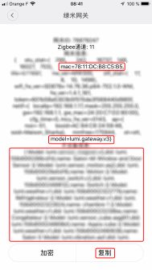

# Activating the developer mode

The activation of the developer mode allows to access the API of the Xiaomi gateway, therefore to receive messages from the different sensors, as well as to control the hardware that can, as well as the gateway itself.

## The "Mi Home" Application

Activation is done from the "Mi Home" application. If it is not installed on your phone, start by doing so:

Once you've done that, launch it.  
Set your region to "Mainland China" by creating your account.
Then connect all your devices, according to their own procedure.  
Finally, update the firmware.

## The gateway

Open your gateway by clicking on its icon. Its management page opens, follow the following steps, in the order indicated:

| Steps |View| Comments |
|:------:|:----------------------------:|------------------------------------------------------|
|1|      |Click on the 3 small dots.
|2|      |Click on "About"
|3|      |Click the red area several times to display the additional menus of the next step.
|4|      |The first menu will take you to step 5, the second to step 6.
|5|      |Activate the developer mode with the button, and note the password, then confirm with ok.
|6|      |In this menu, you will find the Mac address of your gateway, which is its sid; useful to connect the password from the previous step to the gateway, if you have several. Below is a list of devices that are managed by this gateway.

You are now ready to integrate your Xiaomi equipment into Gladys.
