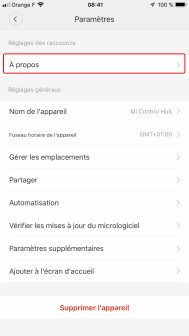
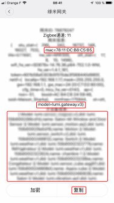

# Activation du mode développeur

L'activation du mode développeur permet de pour accéder à l'API de la passerelle Xiaomi, donc de recevoir les messages des différentes sondes, ainsi que de piloter les matériels le pouvant, ainsi que la passerelle elle-même.

## L'Application "Mi Home"

L'activation se fait à partir de l'application "Mi Home". Si elle n'est pas installé sur votre téléphone, commencez par le faire :

Une fois celà fait, lancez là.  
Définissez votre région sur "Chine continentale" en créant votre compte.
Puis connectez tous vos appareils, selon leur procédure propre.  
Enfin, mettez à jour le firmware.

## La passerelle

Ouvrez votre passerelle en cliquant sur son icône. Sa page de gestion s'ouvre, suivez les étapes suivantes, dans l'ordre indiquée :

| Etapes |Aperçu|Commentaires|
|:------:|:----------------------------:|------------------------------------------------------|
|1|      |Cliquez sur les 3 petits points.
|2|      |Cliquez sur "A propos"
|3|      |Cliquez plusieurs fois sur la zone en rouge, de façons à afficher les menus supplémentaires de l'étapes suivantes.
|4|      |Le premier menu vous ammènera à l'étape 5, le 2ième, à l'étape 6.
|5|      |Activez le mode développeur avec le bouton, et notez le mot de passe, puis validez par ok.
|6|      |Dans ce menu, vous trouverez l'adresse Mac de votre passerelle, qui est son sid ; utile pour relier le mot de passe de l'étape précédente à la passerelle, si vous en avez plusieurs. Vous avez en dessous la liste des périphériques qui sont gérés par cette passerelle.

Vous êtes maintenant prêt à intégrer vos équipements Xiaomi dans Gladys.